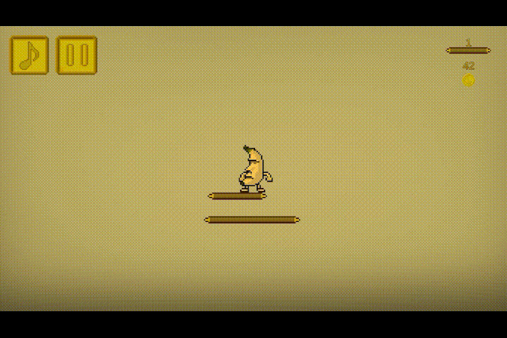

Banana jump

Published on Google Play https://play.google.com/store/apps/details?id=com.UToTGames.BananaJump

# 1. Project Context

A small mobile game focused on core gameplay systems and performance fundamentals.

# 2. What the Project Demonstrates

- Basic procedural generation system for endless gameplay
- Mobile performance considerations (GC, object lifecycle)
- Integration of monetization systems (IAP, Ads)
- Simple dynamic difficulty scaling

# 3. Performance metrics

- Platform: Android;
- Render pipeline: Built-in
- APK size - 25,5MB (LZ4HC);
- Peak GC alloc: ~300 B/frame
- Target frame rate: 60 FPS
- Test device: MediaTek Helio G90T (mid-range Android device)

# 4. Key Systems Implemented

- Skin shop
	- Add new skins from editor;
- Unity IAP
- Unity Ads
	- Rewarded Ads integration for in-game currency.
- Platform generation
	- Randomized platform spawning relative to player position
- Dynamic difficulty
	- Difficulty scaling based on player progression (platform speed increases over time)  

# 5. Limitations

- High coupling;
- Adding new skins requrires updating UI;
- All skins are in the scene, increasing memory usage;

# 6. What I Would Do Differently Today

- Introduce a bootstrap/initialization layer for deterministic system startup  
- Decouple data from scene objects using ScriptableObjects (or Addressables for scalability)  
- Apply Single Responsibility Principle (SRP) to reduce coupling and improve maintainability  
- Implement proper asset pipeline (sprite atlases, optimized assets) to reduce draw calls  
- Improve visual polish and overall user experience

# 7. Lessons Learned

- High coupling significantly reduces maintainability and scalability  
- Lack of a clear entry point complicates system control and debugging  
- Even small projects benefit from early architectural planning
